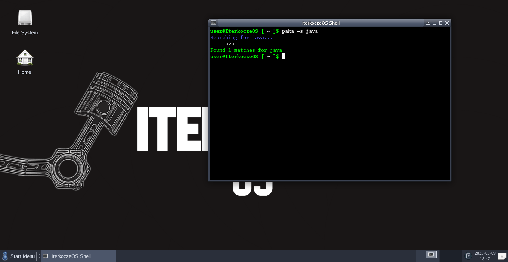

# IterkoczeOS
Official Iterkocze Operating system
- Considerably lightweight
- Made from scratch
- SysVinit
- Ready to use out of the box
- Simple

### https://iterkoczeos.xlx.pl  
### Wiki: https://github.com/Iterkocze-Company/IterkoczeOS/wiki
### Source: https://github.com/Iterkocze-Company/IterkoczeOS-Source
### Package repo: https://github.com/Iterkocze-Company/IterkoczeOS-Packages-Main

